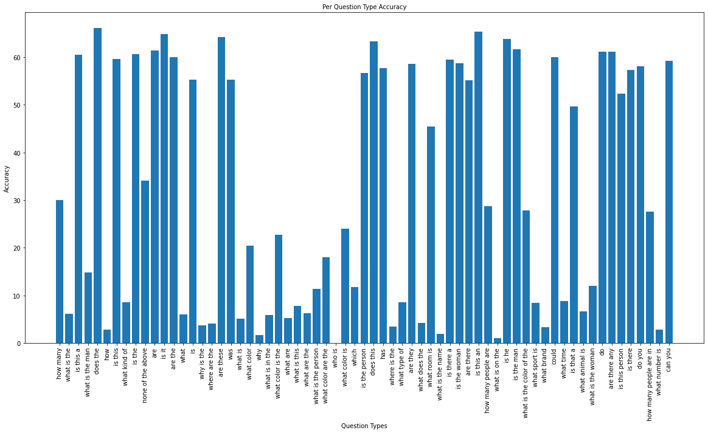
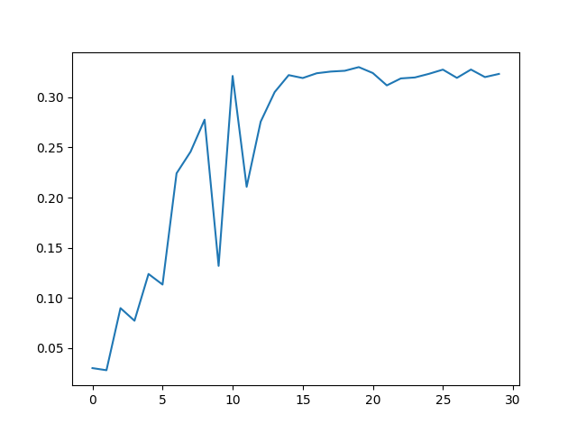

# NaiveVQA: MindSpore & PyTorch Implementations of a Strong VQA Baseline


This repository contains a mindspore reimplementation of the VQA model in the paper [Bottom-Up and Top-Down Attention for Image Captioning and Visual Question Answering](https://arxiv.org/abs/1707.07998).

> Checkout branch `pytorch` for our **pytorch** implementation.

```bash
git checkout pytorch
```

## Performance
We demonstrate an overall accuracy of 34.11% on our test set. This beats the baseline model implemented with MindSpore: [NaiveVQA](https://github.com/vtu81/NaiveVQA), which is a reimplementation of the paper [Show, Ask, Attend, and Answer: A Strong Baseline For Visual Question Answering](https://arxiv.org/abs/1704.03162).

The PyTorch version of the model achieves an accuracy of 64.24%.

* Per Question Type Accuracy (**MindSpore**)



## Install
First, you need:
* Free disk space of at least 60GB
* NVIDIA GPU Platform

> **Notice**: We have successfully tested our code with **MindSpore 1.2.1** on **NVIDIA RTX 2080ti / NVIDIA P100**. Thus we strongly suggest you use MindSpore 1.2.1 GPU version. Since MindSpore is definitely not stable, any version different from 1.2.1 might cause failures.

Then set the cuda version manually according to MindSpore's requirements.

```bash
export CUDA_VER=10.1
export PATH=/usr/local/cuda-$CUDA_VER/bin:$PATH
export CUDA_HOME=/usr/local/cuda-$CUDA_VER
export LD_LIBRARY_PATH=/usr/local/cuda-$CUDA_VER/lib64:$LD_LIBRARY_PATH
```


## Quick Start

### Get and Prepare the Dataset
> The data preparation follows that of [NaiveVQA](https://github.com/vtu81/NaiveVQA).

Get our VQA dataset (a subset of VQA 2.0) from [here](https://drive.google.com/open?id=1_VvBqqxPW_5HQxE6alZ7_-SGwbEt2_zn). Unzip the file and move the subdirectories

* `annotations/`
* `images/`
* `questions/`

into the repository directory `data/`.

Prepare your dataset with:

```bash
# Only run the following command once!

cd data

# Save the original json files
cp annotations/train.json annotations/train_backup.json
cp questions/train.json questions/train_backup.json
cp annotations/val.json annotations/val_backup.json
cp questions/val.json questions/val_backup.json
cp annotations/test.json annotations/test_backup.json
cp questions/test.json questions/test_backup.json

python clean.py # run the clean up script
mv annotations/train_cleaned.json annotations/train.json
mv questions/train_cleaned.json questions/train.json

python align.py # run the aligning script
mv annotations/train_cleaned.json annotations/train.json
mv annotations/val_cleaned.json annotations/val.json
mv annotations/test_cleaned.json annotations/test.json

mv questions/train_cleaned.json questions/train.json
mv questions/val_cleaned.json questions/val.json
mv questions/test_cleaned.json questions/test.json
```

The scripts upon would

* clean up your dataset (there are some images whose ids are referenced in the annotation & question files, while the images themselves don't exist!)
* align the questions' ids for convenience while training

### Preprocess Images

**Preprocess the images** with:

```bash
python preprocess-images.py
```

* If you want to accelerate it, tune up `preprocess_batch_size` at `config.json`
* If you run out of CUDA memory, tune down `preprocess_batch_size` ata `config.json`

The output should be `./resnet-14x14.h5`.

### Preprocess Vocabulary

> The vocabulary only depends on the **train** set, as well as the `config.max_answers` (the number of selected candidate answers) you choose.

**Preprocess the questions and annotations** to get their vocabularies with:

```bash
python preprocess-vocab.py
```

The output should be `./vocab.json`.

### Train

Now, you can **train the model** with:

```bash
python train.py
```

During training, a '.ckpt' file and a '.json' file would be saved under `./logs`. The `.ckpt` file contains the parameters of your model and can be reloaded. The `.json` file contains training metainfo records.

**View the training process** with:

```bash
python view-log.py <path to .json train record>
```

The output `val_acc.png` should look like this:



> To continue training from a pretrained model, set the correct `pretrained_model_path` and the `pretrained` to True in `config.py`.

## Test Your Model

Likewise, you need to preprocess the test set's images before testing. Run

```bash
python preprocess-images-test.py
```

to extract features from `test/images`. The output should be `./resnet-14x14-test.h5`.


We provide `evaluatie.ipynb` to test/evaluate the model. Open the notebook, and set the correct `eval_config`, you're good to go! Just run the following cell one by one, you should be able to **visualize the performance** of your trained model.

## More Things

* To calculate the selected answers' cover rate (determined by `config.max_answers`), check `cover_rate.ipynb`.

## Acknowledgement

This repository is heavily built upon KaihuaTang's repository [VQA2.0 Recent Approachs 2018](https://github.com/KaihuaTang/VQA2.0-Recent-Approachs-2018.pytorch).

Since the original dataset has some mistakes, we borrow the code for data cleaning from [NaiveVQA](https://github.com/vtu81/NaiveVQA).